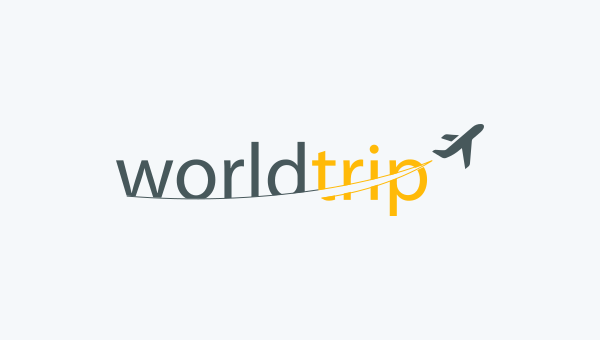

## Sobre

O projeto está sendo desenvolvido dentro da programa de aceleração de carreira **Ignite** da **Rocketseat**. 

---

## Tecnologias utilizadas

O projeto foi desenvolvido com as seguintes tecnologias:

- [ReactJS](https://pt-br.reactjs.org/)
- [NextJS](https://nextjs.org/)
- [Typescript](https://www.typescriptlang.org/)
- [ChakraUI](https://chakra-ui.com/)
- [SwiperJs](https://swiperjs.com/)


---

## Como baixar o projeto

```bash
    # Clonar repositório
    $ git clone https://github.com/thyago608/world-trip

    # Entrar no diretório da aplicação
    $ cd world-trip

    # Baixar as depedências
    $ npm install

    # Executando a aplicação
    $ yarn start
```


Desenvolvido por Thyago Ribeiro 👋
